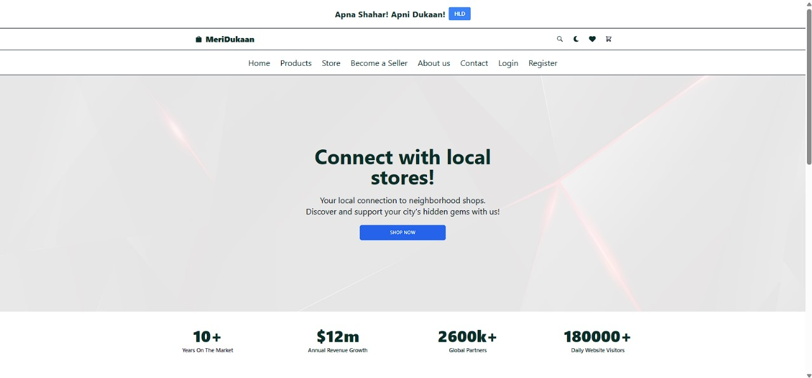
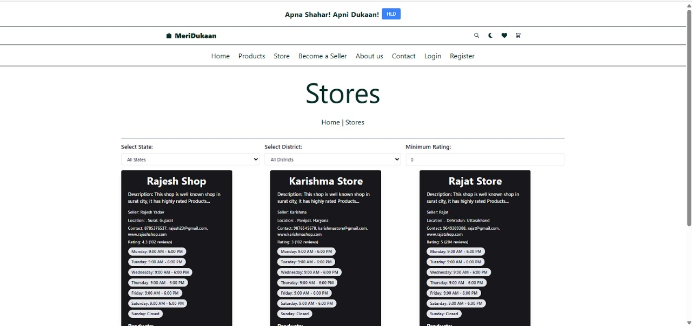
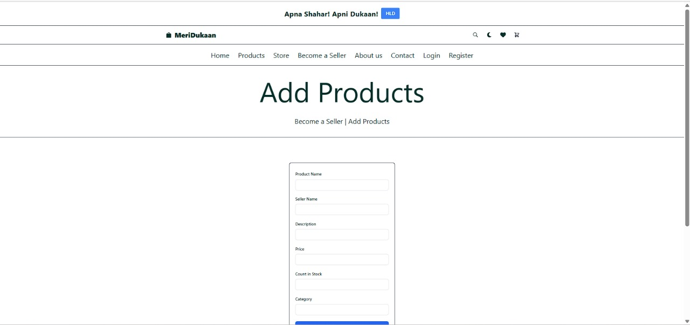
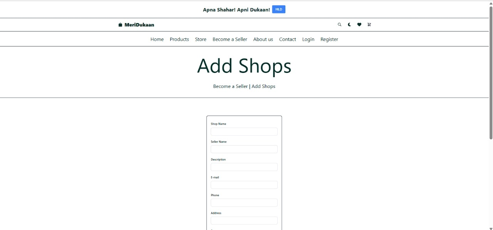

# MeriDukaan


.jpg>)





# Project Features

- React Ecommerce Frontend: A modern and clean interface that highlights our product catalog with elegance and style.
- React Ecommerce Filter: An easy-to-use filtering system that allows customers to sort products by category, price, and more.
- Ecommerce React Website: A full-featured website built on React that exemplifies best practices in web development and design.
- React Shopping App: More than just a website, a complete shopping application designed for seamless online transactions.

# Instructions

1. To run the app you first need to download and install Node.js and npm on your computer. When you download them you need to configure path variables. Here is the link where you can install them: https://nodejs.org/en
2. When you install Node.js and npm on your computer you need to download the project. When you download the project, you need to extract it.
3. After you extract the project you need to open the project folder in your terminal of choice and write:

```
npm install
```

3. After the installation is complete write:

```
npm start
```

4. Open the app in your browser on the address: http://localhost:5173 and enjoy :)

# Key Features:

- Extensive Product Range: Over 100 distinct clothing and shoe items, catering to a wide array of styles and preferences.
- User Accounts: Robust login and registration functionality, allowing customers to create and manage their personal accounts.
- Order Management: Users can view their order history
- Shopping Cart: A dynamic cart system where customers can add items, adjust quantities, or remove products as needed.
- Wishlist: Users can curate a list of desired items for future purchase, enhancing the shopping experience.
- Advanced Search and Filters: A powerful search engine with filters to sort products by price, date of addition, category, brand, gender, and stock availability.
- Category and Brand Sorting: Intuitive categorization and brand-specific pages for easier navigation and product discovery.
- Gender-specific Collections: Separate sections for men's, women's, and unisex items, tailored to suit different gender preferences.
- Stock Indicators: Real-time updates on product availability to ensure customers are informed about in-stock items.

Technologies Used:
Front-End: HTML5, CSS3, JavaScript (with React.js framework)

# Responsive Design:

Mobile-First Approach: The website is designed to be fully responsive and mobile-friendly, ensuring a consistent experience across all devices.
