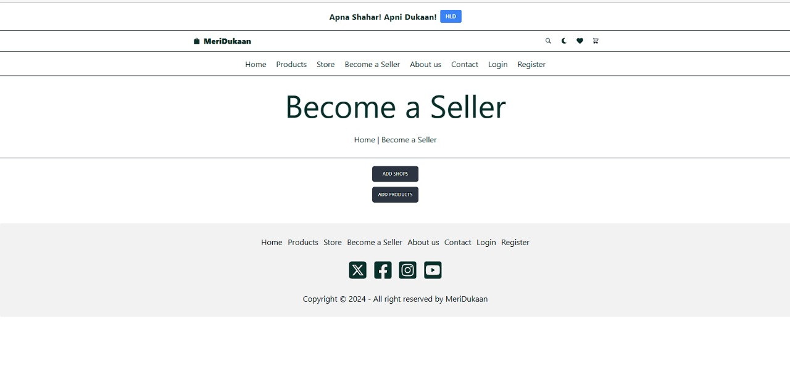

# 🌟 MeriDukaan - Empowering Local Businesses 🌟  

## 🛒 Overview  
**MeriDukaan** is a revolutionary platform that connects local shopkeepers with customers, making shopping local easier and more rewarding. 💼🏠 

🌍 **Our Goal:** Help small businesses thrive in the digital age by solving challenges like high commissions, refund complexities, and unfair competition from large online platforms.  

---

## 🚀 Application Features  

### 🔑 **Key Features:**  
1. **🛍️ Extensive Product Range:**  
   - Choose from **100+ unique items** in clothing and footwear.  
   - Perfectly categorized to suit every style and preference!  

2. **👥 User-Friendly Accounts:**  
   - Hassle-free login and registration.  
   - Track your orders with ease!  

3. **📋 Efficient Order Management:**  
   - Access your **order history** anytime.  

4. **🛒 Shopping Cart & ❤️ Wishlist:**  
   - Add, update, or remove products dynamically.  
   - Save your favorite items for future purchases.  

5. **🔍 Advanced Search & Filters:**  
   - Sort by **price, date, category, brand, gender,** and **stock status.**  

6. **🧭 Gender & Category Sorting:**  
   - Browse effortlessly with **dedicated sections** for men, women, and unisex items.  

7. **📦 Real-Time Stock Indicators:**  
   - Stay informed with **real-time updates** on product availability!  

---

## 💻 **Technologies Used:**  
- **Front-End:** HTML5, CSS3, JavaScript, React.js  
- **Back-End:** Node.js, Express.js, JSON Server  
- **Database:** MongoDB (Local Server)  

---

## 📱 **Responsive Design**  
💡 **Mobile-First Approach:** Enjoy a seamless experience on **mobile, tablet,** and **desktop** devices.  

---

## 🚧 **How to Run the Project**  

### 🛠️ **Prerequisites:**  
1. Download & install **Node.js** and **npm** from [Node.js Official Website](https://nodejs.org/en).  
2. Set up system path variables for Node.js and npm.  

### 🔧 **Steps to Setup:**  
1. **Download and extract the project files.**  
2. **Open the project folder** in your terminal.  
3. Install dependencies by running:  
   ```bash
   npm install
   ```
4. Start the application with:  
   ```bash
   npm start
   ```  
5. Open your browser and access the app at: [http://localhost:5173](http://localhost:5173) 🚀  

---

## 🌈 **Project Highlights**  

### ❓ **Problem Statement:**  
Local businesses are losing their edge due to:  
- **📉 Reduced Sales:** Customers prefer cheaper online alternatives.  
- **🔄 Complex Refunds:** Lack of trust and transparency in returns and exchanges.  
- **💸 High Commissions:** Large platforms eat into shopkeeper profits.  

### 💡 **Proposed Solutions:**  
1. **🗺️ Geographical Categorization:**  
   - Shops registered with detailed addresses.  
   - Filter stores by **state, district,** and **town** for easy discovery.  

2. **💰 Minimal Commissions:**  
   - Lower commission rates help shopkeepers retain more earnings.  

3. **🤝 Refund Assurance:**  
   - Direct customer-shopkeeper interaction for refunds and returns.  

4. **📊 Real-Time Comparisons:**  
   - Compare local vs. online product availability, prices, and reviews.  

---

## 🖼️ **Pages and Features**  

### 🏠 **1. Home Page**  
     
   - A sleek and modern design showcasing the best products! 🌟  

### 🛒 **2. Products Page**  
   .jpg)  
   - Easy navigation and advanced filtering for a smooth shopping experience! 🎯 

### 🏪 **3. Stores Page**  
     
   - Explore local stores and connect with nearby sellers. 🗺️  

### 🤝 **4. Become a Seller Page**  
     
   - Simple registration process for shopkeepers to join the platform. 📝 

### 🏬 **5. Add Shops Page**  
     
   - Shopkeepers can quickly list their stores and details. 🏢 

### 📦 **6. Add Products Page**  
     
   - Easy product uploads for shopkeepers to showcase their offerings. 📋  

---

## 💥 Why Choose MeriDukaan?  

🌟 **Empowering Local Shops:**  
- 🌍 Find and support shops in your neighborhood.  
- 🔄 Hassle-free returns and exchanges with **direct communication**.  

🌟 **Customer-Centric Approach:**  
- 📊 Compare prices and availability transparently.  
- 💸 Save money with local alternatives and enjoy personalized services.  

---

💬 Have questions or suggestions? Drop us a message and let’s make **MeriDukaan** even better! 😊  
